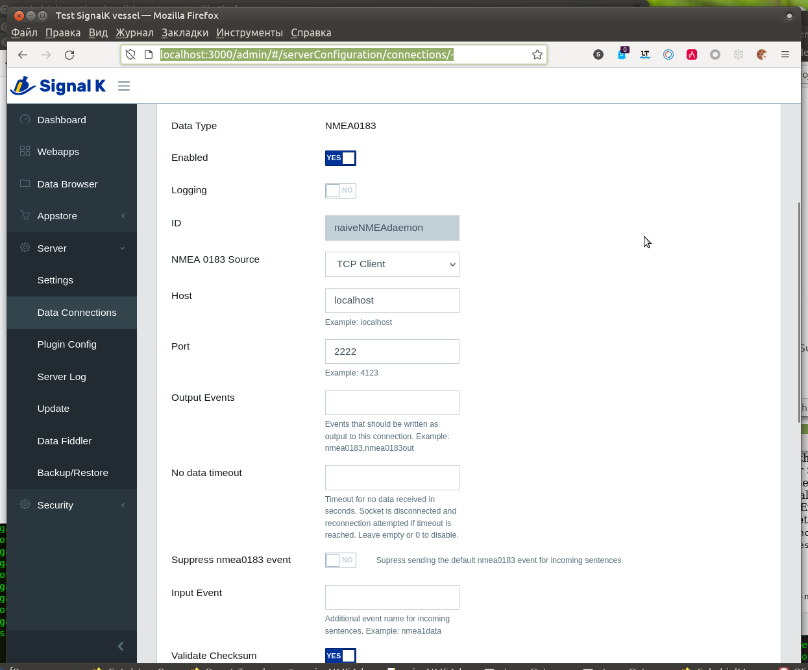

[Русское описание](https://github.com/VladimirKalachikhin/naiveNMEAdaemon/blob/master/README.ru-RU.md)
# naiveNMEAdaemon 

This is the simple web daemon to broadcast NMEA sentences from the given files.
Designed for debugging of applications that use **[gpsd](https://gpsd.io/)**  or **[SignalK](https://signalk.org/)**.

## Features
* Plays one or more NMEA 0183 files simultaneously, by one line from each.
* Custom delay between sending NMEA sentences.
* Runs indefinitely or specified time.
* Filtering sentences.
* Sets bearing by previous point.
* Sets number of satellites to specified.
* Sets speed to specified.
* Sets time in sentences to current.
* Add AIS SART messages
* Allows to save the resulting stream to a file.

## Usage
### Start daemon
`php naiveNMEAdaemon.php [-i...] [-t...] [-b...] [--run...] [--filtering...] [--updsat...] [--updtime] [--sart[=sart_data.php]] [--savesentences[=resulting.nmea]] [log_file_name]`  

Where:  
`-b` bind to transport://address:port, default tcp://127.0.0.1:2222  
Example: `-b=tcp://0.0.0.0:2222` - to all interfaces.  

`-i` list of nmea log files, one sentence per string, default sample1.log  
Example: `-isample1.log` or `-i=sample1AIS.log,forAIStest.nmea`   
or just sample1.log as a last option.

`-t` delay between the log file string sent, microsecunds (1/1 000 000 sec.), default 200000.  
Example: `-t1000000` is 1 sec delay.  

`--run` overall time of work, in seconds. Default 0 - infinity.  
Example: `--run=30`  

`--filtering` sends only listed sentences from list GGA,GLL,GNS,RMC,VTG,VHW,GSA,HDT,ZDA,VDO,VDM... or all, except those specified in the list with the 'x' prefix, or all, but some only one from n'th. Default - all sentences.  
Example: `--filtering=RMC,VDO,VDM` - sends coordinates and AIS only.  
`--filtering=xVDO,xVDM` - sends all except AIS.  
--filtering=10DPT,10DBT - sends all, but only one of 10 depth values.

`--updbearing` sets field 8 'Track made good' of RMC sentences as the bearing from the previous point, boolean.  

`--updsat` sets specified number of satellites in GGA sentence if fix present, but number of satellites is 0. If you generate NMEA from GPX by [GPSBabel](https://www.gpsbabel.org/) the number of satellites will be 0. This is an error for the gpsd (but not for SignalK). Default is on and number of satellites is 6.  

`--updspeed` sets field 7 'Speed over ground' of RMC sentences to the specified value if it is near zero. In km/h, real. Default false, but if it sets then 10.0. For gpsd, filter the GGA sentences if this option is specified.   
Example: `--updspeed=15` 

`--updtime` sets the time in sentences to current, boolean. Default true.  

`--sart=sart_data.php` add a AIS SART (Search and Rescue Transmitter) sentences to a NMEA flow from sart_data.php, default - SARTsample.php. See this file to detail.

`--savesentences` write NMEA sentences to the given file.  
Example: `--savesentences=resulting.nmea`  

### Get data
#### GPSD
`gpsd -G -N -n tcp://localhost:2222`  

#### SignalK

