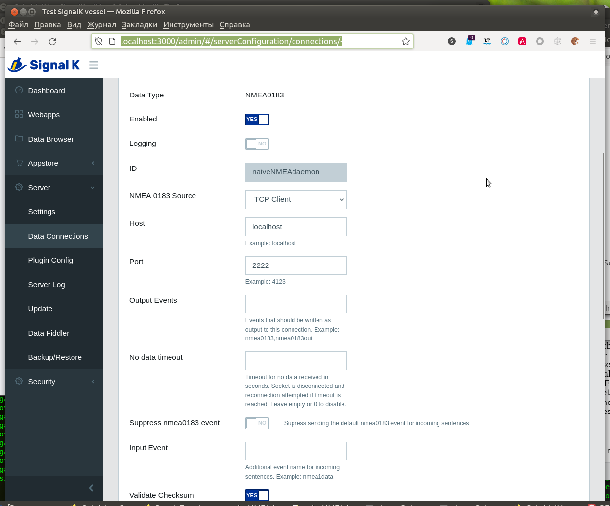

[In English](https://github.com/VladimirKalachikhin/naiveNMEAdaemon/blob/master/README.md)
# naiveNMEAdaemon 

Простой проигрыватель файлов NMEA с сетевым интерфейсом для отладки приложений, основанных на **[gpsd](https://gpsd.io/)**  или **[SignalK](https://signalk.org/)**.

## Возможности
* Воспроизведение одного или нескольких файлов NMEA 0183 совместно, отправлением по одному сообщению из каждого файла поочерёдно.
* Регулируемая частота посылки сообщений.
* Работает непрерывно или указанное количество времени.
* Фильтрация сообщений
* Устанавливает курс в сообщениях как направление от предыдущей к последней точке определения координат.
* Устанавливает число спутников в сообщениях на указанное.
* Устанавливает скорость в сообщениях на указанную.
* Устанавливает временную метку в сообщениях на текущее время.
* Может добавлять в поток сообщений сообщения AIS SART
* Позволяет записывать результирующий поток сообщений в файл.

## Использование
### Запуск демона
`php naiveNMEAdaemon.php [-i...] [-t...] [-b...] [--run...] [--filtering...] [--updsat...] [--updtime] [--sart[=sart_data.php]] [--savesentences[=resulting.nmea]] [log_file_name]`  

Где:  
`-b` обслуживать на протокол://адрес:порт, по умолчанию tcp://127.0.0.1:2222  
Пример: `-b=tcp://0.0.0.0:2222` - принимать соединение на всех имеющихся интерфейсах.  

`-i` список фалов NMEA, по одному сообщению в строке, по умолчанию sample1.log  
Пример: `-isample1.log` или `-i=sample1AIS.log,forAIStest.nmea`   
или просто sample1.log последним параметром.

`-t` пауза между отсылкой сообщений, микросекунд (1/1 000 000 сек.), по умолчанию 200000.  
Пример: `-t1000000` отсылает сообщения раз в секунду.  

`--run` время работы, секунд. По умолчанию 0 - непрерывно.  
Пример: `--run=30`  

`--filtering` отправлять только указанные сообщения из списка GGA,GLL,GNS,RMC,VTG,VHW,GSA,HDT,ZDA,VDO,VDM... или, наоборот, отправлять всё, кроме сообщений, указанныз с приставкой "x" (икс), или всё но мообщения из списка - тоько одно из указанного числа. По умолчанию - не фильтровать исходный файл.  
Пример: `--filtering=RMC,VDM` - отправлять только координаты и сообщения AIS из исходных файлов.  
`--filtering=xVDO,xVDM` - отправлять всё, кроме сообщений AIS.   
--filtering=10DPT,10DBT - отправлять всё, но сообщения о глубине - только одно из десяти.

`--updbearing` устанавливать значение поля 8 'Track made good' сообщений RMC как направление от предыдущей точки определения координат к последней, логическое значение.  

`--updsat` устанавливать указанное количество спутников в сообщениях GGA если координаты определены, но количество спутников в сообщении равно нулю. Так происходит при создании файла NMEA из файла GPX с помощью [GPSBabel](https://www.gpsbabel.org/). Нулевое количество спутников является ошибочным для gpsd, и gpsd не показывает координаты (но SignalK игнорирует это обстоятельство). По умолчанию включено и количество спутников равно 6.  

`--updspeed` устанавливает значение поля 7 'Speed over ground' сообщений RMC в указанную величину, если оно примерно равно нулю. Километры в час, с плавающей точкой. По умолчанию выключено, если скорость не указана, то она будет 10.0 км/час. Для gpsd нужно отфильтровать сообщения GGA, если требуется воспользоваться этой опцией. В противном случае gpsd будет вычислять скорость по сообщениям GGA.   
Пример: `--updspeed=15` 

`--updtime`устанавливает время во всех сообщениях в текущее. Строго говоря, текущее время устанавливается для первого встреченного сообщения RMC, а потом это же время задаётся всем сообщениям до следующего сообщения RMC. Таким образом формируется "эпоха" для gpsd. По умолчанию включено.  
Пример: `--updtime=0` - отключить.

`--sart=sart_data.php` добавлять сообщения AIS SART (Search and Rescue Transmitter) в поток NMEA. Информация для сооьщений берётся из указанного файла sart_data.php, если не указано - из файла SARTsample.php. Подробности - в этом файле.

`--savesentences` записывать итоговый поток сообщений NMEA в указанный файл.  
Пример: `--savesentences=resulting.nmea`  

### Подключение к демону
#### GPSD
`gpsd -G -N -n tcp://localhost:2222`  

#### SignalK

